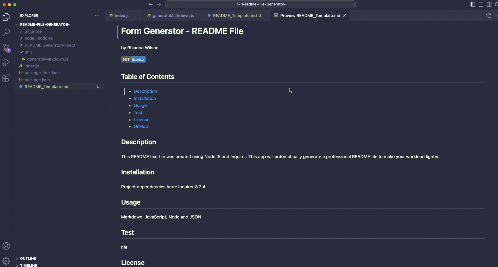
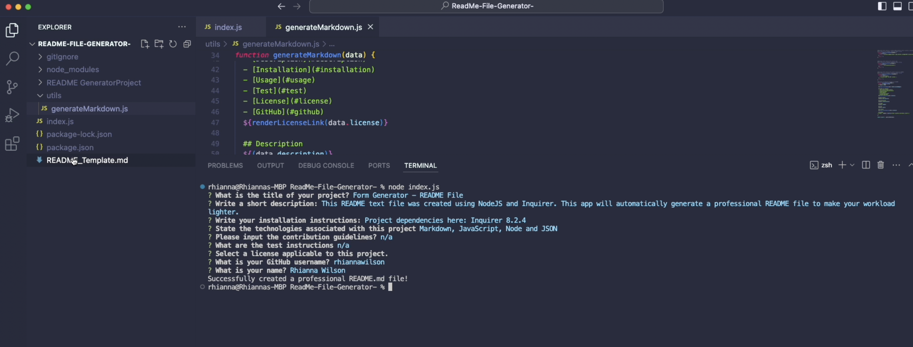
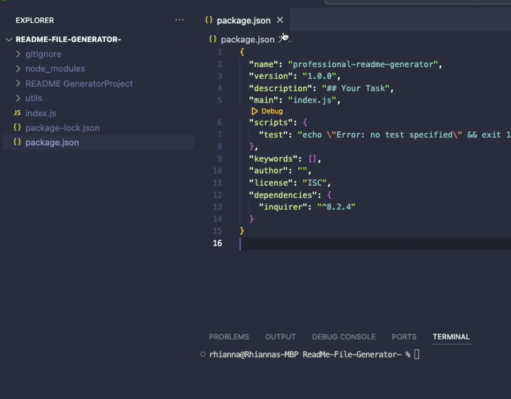
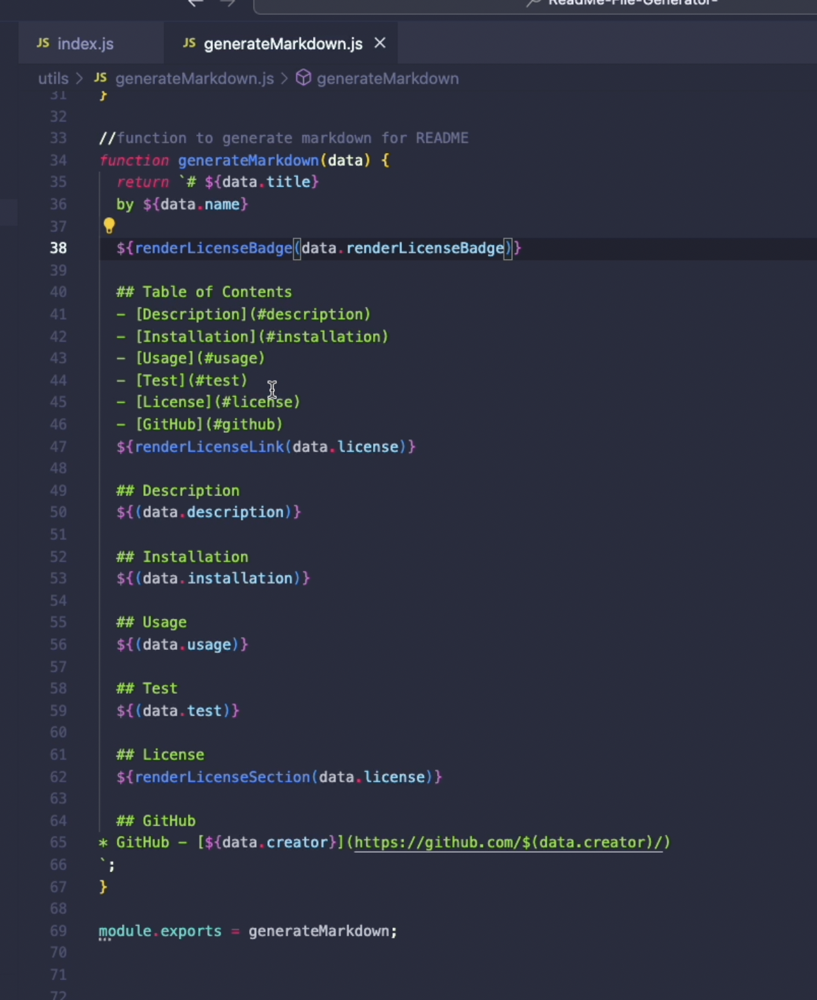

# README Template Application

This README text file was created using Node and Inquirer 8.2.4. This app will automatically generate a professional README file to make your workload lighter!

## Getting Started
Refer to this demonstration to use the application successfully 
> SOUND ON 🔊
> - ![Video demo] https://drive.google.com/file/d/1BuR-5ZlmJ12EHEKqr75MSGS_ktvNwC7d/view?usp=sharing 

> ### User Story
- AS A developer
- I WANT a README generator
- SO THAT I can quickly create a professional README for a new project

> ### Acceptance Criteria
- GIVEN a command-line application that accepts user input
- WHEN I am prompted for information about my application repository
- THEN a high-quality, professional README.md is generated with the title of my project and sections entitled Description, Table of Contents,Installation, Usage, License, Contributing, Tests, and Questions
- WHEN I enter my project title
- THEN this is displayed as the title of the README
- WHEN I enter a description, installation instructions, usage information, contribution guidelines, and test instructions
- THEN this information is added to the sections of the README entitled Description, Installation, Usage, Contributing, and Tests
- WHEN I choose a license for my application from a list of options
- THEN a badge for that license is added near the top of the README and a notice is added to the section of the README entitled License that explains which license the application is covered under
- WHEN I enter my GitHub username
- THEN this is added to the section of the README entitled Questions, with a link to my GitHub profile
- WHEN I enter my email address
- THEN this is added to the section of the README entitled Questions, with instructions on how to reach me with additional questions
- WHEN I click on the links in the Table of Contents
- THEN I am taken to the corresponding section of the README

> ## Usage
> > ### Website Features

1. Markdown
2. JavaScript 
3. Node
4. JSON

> ## Command Line 
> > #### Generated README.md File

> > #### Command Line Questionnaire 

> > #### Inquirer Package, JSON Dependencies

> > #### generateMarkdown.js File 

> ## Credits
N/A

> ## License
Please refer to the LICENSE in the repo
